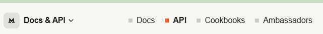
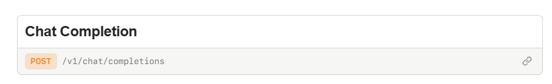
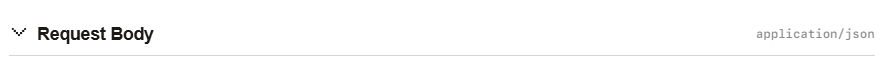
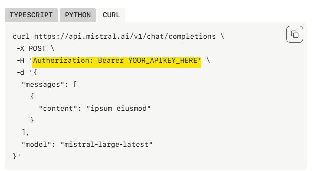
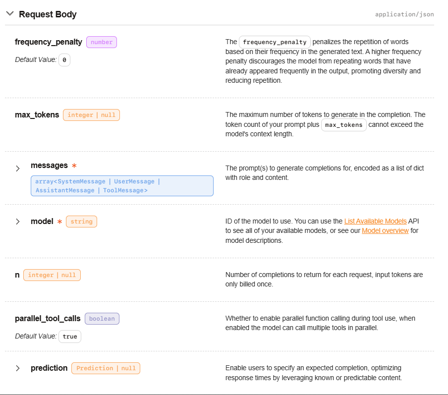

# Comment lire et utiliser la doc de l'API Mistral

Il faut déjà commencer par se rendre sur [la doc de l'API](https://docs.mistral.ai/api).

Pour être surs qu'on est bien sur la doc d'API on voit en haut de page que le carré à côté d'API est coloré  


## Se rappeler comment on appelle une API depuis un client

Il faut déjà se souvenir de ce dont on a besoin pour un `fetch`, et plus particulièrement dans notre cas, pour envoyer des données (dont avec une méthode `POST`).

Petit rappel donc (et sinon y a [la doc](https://developer.mozilla.org/en-US/docs/Web/API/Fetch_API/Using_Fetch)): 
- on fait un appel asynchrone, donc un créé une fonction avec le mot-clef `async` et on fera un `fetch` avec le mot-clef `await`
- on stocke notre `fetch` dans une variable car on en aura besoin + tard :wink:
- le `fetch` pour un envoi de données aura besoin de :
  - l'URL (endpoint) à contacter
  - de la méthode (POST)
  - d'en-têtes facultatifs (headers) contenant par exemple de type de données et, si besoin, l'autorisation (le token) 
  - du body (ce qu'on veut envoyer)
- Une fois le fetch réalisé, on s'assure que la réponse est bien ok avec une petite condition
- si c'est bien ok, on a besoin d'attendre la réponse en json (`await response.json()`)

```JS
// A l'intérieur d'une fonction ayant le mot-clef async
const response = await fetch("la super URL données par l'API",
    {
      method: "POST",
      headers: {
        "Content-Type": "application/json",
        Accept: "application/json",
        Authorization: `Bearer ${monToken}`,
      },
      body: JSON.stringify({ username: "example" }),
});
  const result = await response.json();
  // etc
```

## Aller chercher ce dont on a besoin dans la doc Mistral

1. l'endpoint à contacter

2. les headers:
   - on voit à côté du titre Request Body qu'on est en "application/json"
  
   - on sait qu'on a besoin d'une clé API, il va donc falloir passer un token. On remarque à droite des exemples de code. L'exemple TypeScript utilise une librairie, ce n'est pas notre cas. Allons zieuter du côté de curl... Intéressant, on voit une info : `Authorization: Bearer YOUR_APIKEY_HERE`
   - 
3. le body : on sait déjà qu'on envoie les données en json. regardons les données obligatoires (celles avec *)
    - on voit **messages** et **model**
    

Allons regarder de + près : un petit clic sur le chevron permet d'ouvrir plus en détails :
- on voit que les messages sont des objets, qu'ils ont un `role` et un `content` : il va falloir en tenir compte :wink:
- on voit qu'il faut donner le modèle utilisé (un exemple nous aide bien :wink:)

Bon, on a tout ! 

Il ne nous reste plus qu'à mettre les infos trouvées sur la doc dans notre "fetch de base" :muscle: